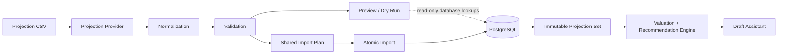

# Fantasy GM

Current development version: v0.3-dev

Fantasy GM is a single-user, desktop-first decision-support application for
ESPN fantasy basketball drafts. It helps answer who to draft, why, how confident
the recommendation is, and what could happen if you wait.

Fantasy GM is not a fantasy hosting platform, league management suite, or
automated drafting bot. It is a local draft decision tool built around one user,
one ESPN-style points league, deterministic projections, and explainable draft
recommendations.

Current status: v0.3 is in progress and focuses on production-ready projection
data infrastructure. Completed capabilities include local PostgreSQL/FastAPI/
React orchestration, league scoring, players, projection snapshots, valuation,
manual snake drafts, draft assistant context, and deterministic draft
recommendations.

Technology stack: React, TypeScript, Vite, FastAPI, SQLAlchemy, Alembic,
PostgreSQL, and Docker Compose.

The canonical application version is maintained in `backend/pyproject.toml`.
The roadmap is in `ROADMAP.md`; detailed projection import documentation is in
`docs/imports/README.md`; existing product and architecture documentation lives
under `docs/` and `research/`.

## Architecture Overview



Preview does not persist data. The recommendation engine reads persisted
projection snapshots; it does not read directly from CSV files.

## Prerequisites

- Docker Desktop with Docker Compose
- Git

Local Node and Python installs are optional for Milestone 0 because the
documented workflow runs through Docker Compose.

## Environment

Copy the safe example file before starting the stack:

```powershell
Copy-Item .env.example .env
```

Real `.env` files are ignored by Git. Do not commit secrets.

Address types:

- Browser-facing frontend: `http://localhost:5173`
- Browser-facing backend: `http://localhost:8000`
- Swagger docs: `http://localhost:8000/docs`
- Docker-internal database hostname: `db`
- Docker-internal backend hostname for the Vite proxy: `backend`

## Start Locally

```powershell
docker compose up --build
```

Then open:

- Frontend: `http://localhost:5173`
- Backend health: `http://localhost:8000/health`
- FastAPI Swagger: `http://localhost:8000/docs`

The frontend calls `/api/health`. Vite proxies `/api` to the backend and strips
the `/api` prefix, so `/api/health` reaches FastAPI as `/health`.

## First-Time Development Workflow

After starting Docker Compose, the app can be populated from the local
Basketball Reference SPS bootstrap files. The frontend shows an
`Import Bootstrap Data` action when no projection sets exist and the ignored raw
CSV and metadata CSV are available.

Expected local raw files:

```text
data/raw/basketball_reference/basketball_reference_sps_2027.csv
data/raw/basketball_reference/basketball_reference_player_metadata_2027.csv
```

The flat `data/raw/basketball_reference_sps_2027.csv` and
`data/raw/basketball_reference_player_metadata_2027.csv` paths remain supported
as temporary compatibility fallbacks.

The one-click bootstrap API is local-development only and is controlled by
`ENABLE_BOOTSTRAP_IMPORT=true`. Docker Compose enables it by default. When the
flag is disabled, the bootstrap status/import endpoints return HTTP 403.

Intended first-time flow:

1. Start Docker Compose.
2. Import bootstrap Basketball Reference data.
3. Browse players.
4. Browse raw projections.
5. Configure league settings.
6. View fantasy points and valuations.
7. Create a draft.

Players and raw projections are browseable before league setup. League
configuration is still required for fantasy scoring, valuations, replacement
levels, and the Draft Assistant. Player position eligibility from the metadata
CSV is required for valuations and draft recommendations.

## Expected Health Response

`GET /health` performs a real PostgreSQL query through SQLAlchemy:

```json
{
  "status": "ok",
  "database": "connected"
}
```

If PostgreSQL is unavailable, the API returns HTTP 503 with:

```json
{
  "detail": "database unavailable"
}
```

## Tests

Backend tests use PostgreSQL through Docker Compose:

```powershell
docker compose run --rm backend pytest
```

## Migrations

Alembic is initialized and reads the database URL from the backend settings:

```powershell
docker compose run --rm backend alembic upgrade head
```

## Seed Local Players

The player seed command inserts or updates a deterministic local development
fixture population. It keeps the original named players and adds generated
synthetic players so valuation can be exercised locally. Fixture names, values,
and IDs are local development data and are not NBA or ESPN identifiers.

```powershell
docker compose run --rm backend python -m app.players.seed
```

The seed is idempotent and does not delete unrelated player rows.

## Seed Local League

The league seed command inserts or updates the singleton local development
league configuration, scoring rules, and roster slots. Fixture keys and IDs are
local development data and are not ESPN identifiers.

```powershell
docker compose run --rm backend python -m app.leagues.seed
```

The seed is idempotent and does not delete unrelated scoring-rule or roster-slot
rows.

## Seed Local Projections

The projections seed command inserts or updates one deterministic manual local
development projection source and one manual season projection set. This command
remains intentionally idempotent for local development and does not create a new
snapshot on every run. Fixture values are local development data.

Run the player and league seeds before projection scoring:

```powershell
docker compose run --rm backend python -m app.players.seed
docker compose run --rm backend python -m app.leagues.seed
docker compose run --rm backend python -m app.projections.seed
```

The projection seed creates or updates projections for the deterministic
synthetic fixture population. It is idempotent and does not delete unrelated
projection sources, projection sets, or projection rows.

## Import Projection CSV

A `ProjectionSet` represents one immutable projection snapshot. Real imports
create a new projection set every time they succeed. Existing projection sets and
their `PlayerProjection` rows are not overwritten, so drafts remain pinned to the
specific `projection_set_id` they captured when created.

The import flow is provider parsing, normalization, validation, read-only
preview, shared import planning, atomic persistence, immutable projection set,
valuation, recommendations, and the Draft Assistant.

Run a local CSV import with:

```powershell
docker compose run --rm backend python -m app.projections.import_csv `
  --path docs/imports/example_projection.csv `
  --source example `
  --source-name "Example Provider" `
  --season 2026 `
  --as-of-date 2026-10-08 `
  --preview
```

Then import with:

```powershell
docker compose run --rm backend python -m app.projections.import_csv `
  --path docs/imports/example_projection.csv `
  --source example `
  --source-name "Example Provider" `
  --season 2026 `
  --as-of-date 2026-10-08
```

By default, imported sets are inactive. To make a new import the active set for
its source, season, and projection type, add `--activate`. Activation deactivates
the previous active set for that same source, season, and projection type, but it
does not delete or mutate historical projection rows.

The full CSV contract, preview behavior, row-count semantics, and validation
codes are documented in `docs/imports/README.md` and
`docs/imports/validation_rules.md`.

Duplicate imports are allowed. Importing the same CSV twice creates two
projection snapshots unless the command fails validation. Milestone 11 does not
add file hashes or import deduplication.

Player identity in V1 is provider-local: the importer resolves players by
`source` plus `player_id`. Provider player IDs are treated as opaque identifiers:
they are trimmed during CSV normalization and then compared and stored
case-sensitively. If no provider identity exists yet, the importer uses an exact
full-name fallback only when exactly one matching player exists. It does not
perform fuzzy matching or cross-provider canonical matching.

Projection snapshots are immutable, but current player metadata is not. A
successful import updates the resolved `Player` row's name, team, primary
position, active flag, and current eligibility positions. The latest successful
import for a resolved player replaces that player's current eligibility set
without changing historical `PlayerProjection` rows.

Downgrading from Milestone 11 to the previous migration is intentionally blocked
if duplicate projection snapshots exist for the same source, season, projection
type, and as-of date. The downgrade does not delete or merge projection snapshots.

## Seed Local Draft Eligibility

The draft seed command inserts player eligibility rows for the deterministic
local player fixtures. It does not create a draft session. Fixture eligibility
values are local development data and are not ESPN or NBA identifiers.

Run it after seeding players:

```powershell
docker compose run --rm backend python -m app.drafts.seed
```

The seed is idempotent and does not delete unrelated eligibility rows.

## Full Local Demo Seed Workflow

From a migrated database, run the standard seeds in this order:

```powershell
docker compose run --rm backend python -m app.players.seed
docker compose run --rm backend python -m app.leagues.seed
docker compose run --rm backend python -m app.projections.seed
docker compose run --rm backend python -m app.drafts.seed
```

This creates approximately 180 synthetic projected players with balanced base
positions, multi-position eligibility, varied NBA-team labels, varied games and
minutes, broad fantasy-point distribution, and a few deterministic ties. The
data is for local functionality testing only, not real NBA analysis.

No draft session is seeded. Open `http://localhost:5173`, choose Valuations, and
the page should load replacement levels plus player valuation rows. To test
draft-available valuation, create and start a temporary draft from the Draft page;
the Available Player Values table then uses `GET /valuations?available_only=true`.

## Players API

List players:

```powershell
Invoke-RestMethod "http://localhost:8000/players"
```

Search and filter players:

```powershell
Invoke-RestMethod "http://localhost:8000/players?search=jokic&team=DEN&position=C&active=true"
```

The list response includes matching `total` before pagination:

```json
{
  "items": [],
  "total": 0,
  "limit": 50,
  "offset": 0
}
```

## League API

Get the singleton league configuration:

```powershell
Invoke-RestMethod "http://localhost:8000/league"
```

If no league is configured, the API returns HTTP 404:

```json
{
  "detail": "league configuration not found"
}
```

Save the singleton league configuration:

```powershell
Invoke-RestMethod "http://localhost:8000/league" -Method Put -ContentType "application/json" -Body $json
```

`PUT /league` replaces the singleton league, scoring rules, and roster slots in
one database transaction. The frontend exposes this through the League Settings
view at `http://localhost:5173`.

## Projections API

List projection sources and sets:

```powershell
Invoke-RestMethod "http://localhost:8000/projection-sources"
Invoke-RestMethod "http://localhost:8000/projection-sets"
```

Get one projection set:

```powershell
Invoke-RestMethod "http://localhost:8000/projection-sets/1"
```

List projected players scored with the current singleton league configuration:

```powershell
Invoke-RestMethod "http://localhost:8000/projection-sets/1/players?sort=projected_fantasy_points&direction=desc"
```

Supported player-projection filters are `search`, `team`, `position`, `limit`,
`offset`, `sort`, and `direction`. Public sort keys include
`minutes_per_game`, `fantasy_points_per_game`, and
`projected_fantasy_points`.

Projection-set list and detail responses include source metadata, season,
as-of date, import timestamp, active status, and derived `player_count`.

If the singleton league configuration is missing, projected-player scoring
returns HTTP 409:

```json
{
  "detail": "league configuration required"
}
```

## Projection Scoring Note

Fantasy points are derived from the current singleton league scoring rules, not
stored on projection rows. Projection sorting by `fantasy_points_per_game` or
`projected_fantasy_points` currently calculates the matching rows in the
application and sorts them in memory. That is intentional and acceptable for the
current NBA-scale dataset. A larger future version may move this to
database-side optimization or precomputed valuation data.

Projection, draft, and valuation features share one backend scoring component so
fantasy-point formulas do not diverge. Missing scoring-rule categories
contribute zero points.

## Valuations API

Milestone 5 calculates player valuation dynamically from the singleton league,
the selected projection set, player eligibility, and current draft state. It does
not persist valuation rows, create valuation snapshots, or provide personalized
draft recommendations.

List player valuations:

```powershell
Invoke-RestMethod "http://localhost:8000/valuations?sort=overall_rank&direction=asc"
```

Get replacement-level context:

```powershell
Invoke-RestMethod "http://localhost:8000/valuations/replacement-levels"
```

Get one player valuation:

```powershell
Invoke-RestMethod "http://localhost:8000/players/1/valuation"
```

Supported valuation filters are `search`, `team`, `position`, `limit`, and
`offset`. Supported sorts are `player`, `team`, `position`,
`fantasy_points_per_game`, `projected_fantasy_points`, `overall_vor`, and
`overall_rank`.

Valuation uses projected season fantasy points as the value-over-replacement
basis:

```text
fantasy points per game = league scoring applied to per-game projections
projected fantasy points = fantasy points per game * projected games
VOR = projected fantasy points - positional replacement fantasy points
```

FPPG is displayed as supporting information. There is no blended score,
durability multiplier, injury modifier, auction value, ADP, or recommendation
logic in Milestone 5.

Replacement levels come from exact league-wide active-roster optimization. The
application expands every active slot by team count and finds the highest-total
assignment of projected players to active lineup slots, respecting eligibility:

- `PG`, `SG`, `SF`, `PF`, and `C` accept only the matching base position.
- `G` accepts `PG` or `SG`.
- `F` accepts `SF` or `PF`.
- `UTIL` accepts `PG`, `SG`, `SF`, `PF`, or `C`.
- `BE` contributes to the informational drafted-player target only.
- `IR` is ignored for active demand and drafted-player target.

After active rosters are filled, each positional replacement player is the best
remaining player eligible at that base position. V1 uses one cutoff player, not
a replacement band. Negative VOR is preserved because it indicates a player
projects below replacement level.

Multi-position players receive one position-value entry for every eligible base
position. Overall VOR is the highest positional VOR, with ties broken in
`PG`, `SG`, `SF`, `PF`, `C` order. Players without eligibility remain visible in
valuation lists when projected, but have empty position values and no overall
VOR.

Projection-set resolution follows this order:

1. Explicit `projection_set_id`.
2. Current setup or in-progress draft's snapshotted projection set.
3. The deterministic active projection set.

`available_only=true` requires a current setup or in-progress draft, always uses
that draft's snapshotted projection set, and excludes drafted players. Full-pool
ranks are calculated before filters, pagination, and available-player exclusion,
so filtered or draft-available results may show rank gaps.

If league configuration is missing, valuation endpoints return HTTP 409:

```json
{
  "detail": "league configuration required"
}
```

If a projection pool cannot supply replacement players for the configured active
roster demand, valuation endpoints return HTTP 409:

```json
{
  "detail": "insufficient eligible player pool"
}
```

## Draft API

Milestone 4 supports one manually managed snake draft for the singleton league.
Draft creation snapshots the singleton league, the calculated draft rounds, and
the deterministic active projection set. Later league edits or projection-set
activation changes do not alter an existing draft. Draft rounds are calculated
from PG, SG, SF, PF, C, G, F, UTIL, and BE roster-slot counts; IR is excluded.

Create a setup draft:

```powershell
Invoke-RestMethod "http://localhost:8000/draft" -Method Post -ContentType "application/json" -Body $json
```

Get draft state:

```powershell
Invoke-RestMethod "http://localhost:8000/draft"
Invoke-RestMethod "http://localhost:8000/draft/board"
Invoke-RestMethod "http://localhost:8000/draft/available-players"
```

Start the draft and record the next pick:

```powershell
Invoke-RestMethod "http://localhost:8000/draft/start" -Method Post
Invoke-RestMethod "http://localhost:8000/draft/picks" -Method Post -ContentType "application/json" -Body '{"player_id":1}'
```

Undo the latest pick:

```powershell
Invoke-RestMethod "http://localhost:8000/draft/picks/latest" -Method Delete
```

Reset the current draft:

```powershell
Invoke-RestMethod "http://localhost:8000/draft/reset" -Method Post
```

Resetting a draft removes every recorded pick and returns the existing draft
session to setup. It preserves the draft ID, fantasy teams, team names, draft
positions, user-team marker, team count, round count, league configuration, and
snapshotted projection set. The frontend requires confirmation before sending
the reset request. The Draft Assistant is unavailable after reset until the draft
is started again.

Get player eligibility:

```powershell
Invoke-RestMethod "http://localhost:8000/players/1/eligibility"
```

Available draft players are active players included in the draft's snapshotted
projection set and not already drafted in that draft session. A projected player
without eligibility remains visible with empty eligibility and compatible-slot
lists, but cannot be drafted until eligibility exists.

Setup drafts can be edited before starting. Starting a draft freezes the fantasy
teams, draft positions, user-team designation, rounds, team count, and projection
set. Setup and in-progress drafts may be deleted. Completed drafts are preserved
and cannot be deleted through the Milestone 4 API. Setup, in-progress, and
completed drafts may be reset.

League scoring and roster settings are locked while a setup or in-progress draft
exists, because draft valuation depends on those settings. Delete the active
draft or complete it before changing league settings. Completed drafts do not
block league configuration changes.

Milestone 5 does not provide draft recommendations, automatic roster-slot
assignment, historical draft browsing, or live ESPN synchronization.

## Draft Assistant MVP

Milestones 6 through 8 add a compact deterministic Draft Assistant to the Draft
page during an in-progress draft. It surfaces several reasonable options,
derived draft-context signals, and up to five recommended picks without claiming
there is one objectively correct pick.

Get the assistant dashboard:

```powershell
Invoke-RestMethod "http://localhost:8000/draft/assistant"
```

Optional query parameters:

- `limit_per_section`: number of options per section, default `5`, maximum `10`
- `include_assignments`: include detailed dynamic roster assignments, default `true`

The assistant requires an in-progress draft. If no draft exists, the draft is
still in setup, or the draft is completed, the API returns:

```json
{
  "detail": "active draft required"
}
```

The assistant remains available when another fantasy team is on the clock. The
response includes `is_user_on_clock` so the UI can label the state clearly.

Milestone 7 extends the same response with an `intelligence` object by default.
The backend derives this from the current draft's snapshotted projection set and
the existing valuation universe:

- `next_user_pick`: the user's next scheduled snake-draft pick, picks until that
  pick, and consecutive turn-pick context.
- `availability_outlook`: top available players labeled as
  `UNLIKELY_TO_RETURN`, `AT_RISK`, or `COULD_RETURN`.
- `positional_scarcity`: base-position scarcity using position-specific VOR,
  expected VOR drop before the next user pick, and remaining positive-VOR depth.
- `value_drop`: the next meaningful overall VOR drop within the scanned
  available-player window.

Availability uses a fixed local deterministic buffer of 2 players beyond the
next-pick window. A meaningful value drop is 10.00 season VOR points, scanned
across the first 25 available ranked players. Positional scarcity uses 10.00 VOR
for high-drop severity, 5.00 VOR for medium-drop severity, and 2 positive-VOR
options as the low-depth threshold.

Milestone 8 extends the same response with `recommendations` by default. The
recommendation engine is deterministic and evaluates only currently available
players that have both an overall VOR and at least one eligibility row. It uses
the current draft's snapshotted projection set, current user roster assignment,
availability outlook, positional scarcity, and value-drop signal.

Recommendation candidates are grouped in two passes:

- Close-value candidates are every recommendation-eligible player within 10.00
  VOR of the best available player's overall VOR. These candidates receive a
  score breakdown and may be reordered by value proximity, roster fit,
  scarcity, availability, value-drop context, and useful roster flexibility.
- Fallback-value candidates are the remaining top 10 recommendation-eligible
  available players. They preserve best-available order, do not receive a score
  breakdown, and cannot appear above close-value candidates.

The API returns at most five recommendations. Close-value score components use
Decimal arithmetic and are quantized to two decimals. The base value-proximity
score maps a 0.00 VOR gap to 100.00 and a 10.00 VOR gap to 80.00. Positive
context can add roster-fit, scarcity, availability, value-drop, and flexibility
points; bench-only or unassigned roster fit can reduce the close-value score.

Recommendation reason and warning codes are structured so the frontend can keep
labels concise and cautious:

- Positive signals include `BEST_AVAILABLE_VALUE`, `STRONG_VALUE`,
  `FILLS_RESTRICTIVE_STARTER_SLOT`, `FILLS_FLEX_SLOT`,
  `IMPROVES_ACTIVE_LINEUP`, `MULTI_POSITION_FLEXIBILITY`,
  `LIMITED_POSITION_DEPTH`, `POSITION_VALUE_DROP`, `UNLIKELY_TO_RETURN`,
  `AT_RISK_BEFORE_NEXT_PICK`, and `BEFORE_MEANINGFUL_VALUE_DROP`.
- Warnings include `BENCH_ONLY_FIT`, `POSITION_ALREADY_DEEP`,
  `COULD_RETURN_LATER`, `SIGNIFICANT_VALUE_REACH`, and `MISSING_CONTEXT`.

Recommendation explanations are generated from fixed backend templates and avoid
absolute claims such as guarantees, certainty, or definitive availability.

### Assistant Sections

Best Available lists the highest-ranked available players by the existing
full-pool valuation ranks from Milestone 5.

Best by Position lists top available players for `PG`, `SG`, `SF`, `PF`, and `C`
using position-specific VOR and position rank. A multi-position player may appear
in more than one position list.

Roster Fits lists available players who can fill one or more open active roster
slots. It preserves Best Available ordering and does not apply a combined
recommendation score or arbitrary need bonus.

The full Available Player Values table remains available below the assistant for
complete browsing, filtering, and sorting.

### Dynamic Roster Assignment

Drafted players are assigned to roster slots dynamically for assistant display
only. The assignment is not persisted and can be recalculated after each pick or
undo.

The assistant assigns user-team players to active slots:

- `PG`, `SG`, `SF`, `PF`, and `C` accept only matching base eligibility.
- `G` accepts `PG` or `SG`.
- `F` accepts `SF` or `PF`.
- `UTIL` accepts `PG`, `SG`, `SF`, `PF`, or `C`.
- `BE` is bench capacity and does not create positional roster-fit needs.
- `IR` is ignored for normal draft-assistant capacity.

The assignment is exact and deterministic. It maximizes active slots filled,
then maximizes projected fantasy points assigned to active slots, then uses
stable eligibility, slot, player-name, and player-id tie-breakers. Players
without eligibility are shown as unassigned and are not silently assigned from
`primary_position`.

### Reason Codes

The backend returns structured reason metadata. The frontend maps it to concise
labels:

- `BEST_AVAILABLE`: Top overall value
- `BEST_AT_POSITION`: Top available position option
- `FILLS_OPEN_SLOT`: Matches an open roster slot
- `FILLS_RESTRICTIVE_SLOT`: Fills an open `PG`, `SG`, `SF`, `PF`, or `C` slot
- `MULTI_SLOT_FLEXIBILITY`: Fits multiple open slots
- `USER_ON_CLOCK`: The user is currently on the clock
- `INSIDE_NEXT_PICK_WINDOW`: Player falls inside the expected picks before the
  user's next pick
- `NEAR_NEXT_PICK_WINDOW`: Player is within the fixed risk buffer beyond the
  next-pick window
- `BEYOND_NEXT_PICK_WINDOW`: Player is outside the fixed risk buffer
- `LARGE_VALUE_DROP`: A meaningful value drop follows this point
- `POSITION_VALUE_DROP`: Positional VOR is expected to fall before the user's
  next pick
- `LIMITED_POSITION_DEPTH`: Few positive-VOR options remain at the position
- `POSITION_DEPTH_AVAILABLE`: Position has lower current scarcity
- `NO_FUTURE_USER_PICK`: No future user pick is scheduled

Milestone 8 does not use machine learning, Monte Carlo simulation, opponent
prediction, probability estimates, ADP, auction values, full tiers, draft-run
detection, automated drafting, persisted recommendation history, or full
remaining-round optimization. Those are deferred to later milestones.
